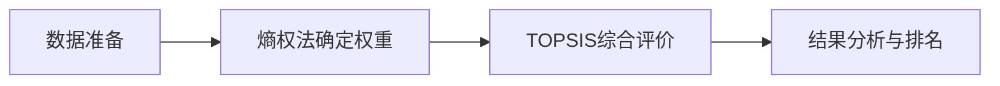

> 摘要

  

熵权法是一种基于信息论理论的客观赋权方法，通过计算各指标的信息熵来确定权重，避免了主观赋权的局限性。本文详细阐述了熵权法的理论基础、计算步骤及其在多指标综合评价中的应用。

  

## 1. 理论基础

  

### 1.1 信息熵理论

信息熵概念最初由Shannon在1948年提出，用于衡量信息的不确定性。在多指标评价体系中，熵值反映了指标数据的离散程度，熵值越小，指标提供的信息量越大，在综合评价中的权重应越大。

  

### 1.2 方法原理

熵权法基于如下假设：当某指标的各评价对象差异较大时，该指标在评价体系中的区分作用更明显，应赋予更大权重；反之，当各含$m$个评价对象和$n$个评价指标，构成评价矩指标的区分作用有限，应赋予较小权重。

  

## 2. 详细计算步骤

  
##
# 步骤一：构建原始数据矩阵#
  设评价问题包评价对象在某指标上差异较小时，该阵$\mathbf{X} = (x_{ij})_{m \times n}$。在本研究的空气质量评价案例中，$m=4$（四个城市：A、B、C、D），$n=3$（三个污染物指标：SO₂、NO₂、PM10），故初始数据矩阵为：

  

$$\mathbf{X} = \begin{pmatrix}
x_{11} & x_{12} & x_{13} \\
x_{21} & x_{22} & x_{23} \\
x_{31} & x_{32} & x_{33} \\
x_{41} & x_{42} & x_{43}
\end{pmatrix}_{4 \times 3}$$

  

其中，$x_{ij}$表示第$i$个城市在第$j$个污染物指标上的观测值。

  

熵权法的核心思想是通过计算各指标的信息熵$E_j$来度量其信息载荷，进而确定权重向量$\mathbf{W} = (w_1, w_2, w_3)^T$。

  

数学模型的理论框架可表述为：

  

$$w_j = f(E_j) = \frac{1-E_j}{\sum_{k=1}^{3}(1-E_k)}, \quad j=1,2,3$$

  

其中，$E_j$为第$j$个指标的归一化信息熵，$(1-E_j)$称为信息效用值或变异系数，反映指标$j$的信息载荷。矩阵中共包含12个数据元素（4城市×3指标），但用于权重计算的是3个指标维度上的统计特征。

设有m个评价对象，n个评价指标，构建原始数据矩阵：

  

$$X = (x_{ij})_{m \times n}$$

  

其中，$x_{ij}$表示第i个评价对象在第j个指标上的原始数值。

  

### 步骤二：数据标准化处理

  

由于各指标量纲不同，需进行标准化处理，消除量纲影响。

  

**正向指标标准化**（目标型指标）：

$$x'_{ij} = \frac{x_{ij} - \min_i(x_{ij})}{\max_i(x_{ij}) - \min_i(x_{ij})}$$

  

**负向指标标准化**：

$$x'_{ij} = \frac{\max_i(x_{ij}) - x_{ij}}{\max_i(x_{ij}) - \min_i(x_{ij})}$$

  

**适度指标标准化**：

$$x'_{ij} = 1 - \frac{|x_{ij} - x_{best}|}{\max\{\max_i(x_{ij}) - x_{best}, x_{best} - \min_i(x_{ij})\}}$$

  

其中，$x_{best}$为指标的最优值。

  

### 步骤三：计算指标概率矩阵

  

对于标准化后的数据矩阵，计算第i个评价对象在第j个指标下的概率：

  

$$p_{ij} = \frac{x'_{ij}}{\sum_{i=1}^{m} x'_{ij}}$$

  

其中，$p_{ij} \geq 0$且$\s://。

  

**特殊处理**：当$x'_{ij} = 0$时，为避免对数计算中出现无意义结果，通常将其调整为一个极小正数$\epsilon$（如$10^{-6}$）。

  

### 步骤四：计算各指标信息熵

  

第j个指标的信息熵计算公式为：

  

$$e_j = -k \sum_{i=1}^{m} p_{ij} \ln(p_{ij})$$

  

其中，$k = \frac{1}{\ln(m)}$为调节常数，确保$0 \leq e_j \leq 1$。

  

**边界条件处理**：

- 当$p_{ij} = 0$时，定义$p_{ij} \ln(p_{ij}) = 0$

- 当所有$p_{ij}$相等时，$e_j$达到最大值1

- 当某个$p_{ij} = 1$，其余为0时，$e_j$达到最小值0

  

### 步骤五：计算信息效用值

  

第j个指标的信息效用值（变异系数）为：

  

$$d_j = 1 - e_j$$

  

**物理意义**：

- $d_j$值越大，表明该指标在不同评价对象间的差异越大

- 该指标在综合评价中的重要性越高

- $d_j \in [0,1]$，且$d_j$与$e_j$呈负相关关系

  

### 步骤六：确定客观权重

  

第j个指标的客观权重为：

  

$$w_j = \frac{d_j}{\sum_{j=1}^{n} d_j}$$

  

**权重性质验证**：

- 非负性：$w_j \geq 0$，$\forall j = 1,2,\ldots,n$

- 归一性：$\sum_{j=1}^{n} w_j = 1$

- 敏感性：权重大小与指标信息量成正比

  

### 步骤七：综合评价值计算

  

各评价对象的综合评价值为：

  

$$S_i = \sum_{j=1}^{n} w_j \cdot x'_{ij}$$

  

其中，$S_i$值越大，表明第i个评价对象的综合表现越好。 四城市空气质量综合评价分析报告

  

## 摘要

  

本研究采用熵权法-TOPSIS综合评价模型，对四个城市（A、B、C、D）在2025年6月1日至7月25日期间的空气质量进行系统性评估。通过对SO₂、NO₂、PM10三项关键污染物指标的深度分析，得出客观可靠的城市排名结果。

  

## 参考文献

  

1. Shannon C E. A mathematical theory of communication[J]. The Bell System Technical Journal, 1948, 27(3): 379-423.

2. 邱均平, 段宇锋, 王菲菲. 信息计量学[M]. 北京: 科学出版社, 2018.

3. 汪应洛. 系统工程理论、方法与应用[M]. 北京: 高等教育出版社, 2019.
## 1. 研究背景与方法

  

### 1.1 研究目标

- **主要目标**：建立科学的多指标空气质量评价体系

- **核心任务**：对四个城市的空气质量进行客观排序

- **方法创新**：采用熵权法客观赋权，结合TOPSIS综合评价

  

### 1.2 技术路线

  

**四步分析法**：

1. **数据准备**：计算各城市污染物统计指标

2. **熵权法赋权**：基于数据变异程度客观确定权重

3. **TOPSIS评价**：构建理想解距离模型

4. **综合排名**：生成最终空气质量排序

  

  

## 2. 数据分析结果

  

### 2.1 基础数据概览

  

**数据范围**：2025年6月1日 - 2025年7月25日（55天观测数据）

  

**各城市污染物统计特征**：

  

| 城市 | 污染物 | 平均值(mg/m³) | 标准差 | 最大值 | 变异系数 |
|------|--------|---------------|--------|--------|----------|
| 城市A | SO₂ | 0.0387 | 0.0145 | 0.0760 | 0.3751 |
| 城市A | NO₂ | 0.0290 | 0.0078 | 0.0520 | 0.2687 |
| 城市A | PM10 | 0.0705 | 0.0257 | 0.1480 | 0.3644 |
| 城市B | SO₂ | 0.0340 | 0.0256 | 0.1000 | 0.7543 |
| 城市B | NO₂ | 0.0353 | 0.0109 | 0.0670 | 0.3078 |
| 城市B | PM10 | 0.0553 | 0.0190 | 0.1270 | 0.3433 |
| 城市C | SO₂ | 0.0163 | 0.0156 | 0.0770 | 0.9579 |
| 城市C | NO₂ | 0.0269 | 0.0126 | 0.0550 | 0.4670 |
| 城市C | PM10 | 0.0339 | 0.0176 | 0.0840 | 0.5212 |
| 城市D | SO₂ | 0.0160 | 0.0085 | 0.0370 | 0.5343 |
| 城市D | NO₂ | 0.0310 | 0.0127 | 0.0600 | 0.4100 |
| 城市D | PM10 | 0.0725 | 0.0368 | 0.1580 | 0.5078 |

  

### 2.2 评价矩阵构建

  

**标准评价矩阵**（基于平均值）：

  

| | SO₂ | NO₂ | PM10 |
|------|-----|-----|------
| 城市A | 0.0387 | 0.0290 | 0.0705 |
| 城市B | 0.0340 | 0.0353 | 0.0553 |
| 城市C | 0.0163 | 0.0269 | 0.0339 |
| 城市D | 0.0160 | 0.0310 | 0.0725 |

  

## 3. 熵权法权重确定

  

### 3.1 权重计算原理

  

熵权法通过计算各指标的信息熵来客观确定权重，**信息熵越小，指标的变异程度越大，权重越高**。

  

### 3.2 权重分配结果

  

| 指标 | 熵权法权重 | 权重占比 |
|------|------------|----------|
| **PM10** | **0.4560** | **45.60%** |
| **SO₂** | **0.3148** | **31.48%** |
| **NO₂** | **0.2292** | **22.92%** |

  

### 3.3 权重结果解读

  

1. **PM10权重最高（45.60%）**

- 原因：PM10在四城市间差异最大，区分度最高

- 意义：PM10成为评价空气质量的主导指标

  

2. **SO₂权重居中（31.48%）**

- 城市间SO₂浓度存在显著差异

- 对综合评价具有重要影响

  

3. **NO₂权重相对较低（22.92%）**

- 各城市NO₂浓度相对接近

- 区分能力相对较弱

  

## 4. TOPSIS综合评价

  

### 4.1 标准化处理

  

**标准化决策矩阵**：

| | SO₂ | NO₂ | PM10 |
|------|-----|-----|------|
| 城市A | 0.6876 | 0.4723 | 0.5872 |
| 城市B | 0.6027 | 0.5744 | 0.4604 |
| 城市C | 0.2891 | 0.4383 | 0.2818 |
| 城市D | 0.2836 | 0.5049 | 0.6032 |

  

### 4.2 加权标准化

  

**加权标准化矩阵**：

  

| | SO₂ | NO₂ | PM10 |
|------|-----|-----|------|
| 城市A | 0.2164 | 0.1083 | 0.2678 |
| 城市B | 0.1897 | 0.1316 | 0.2099 |
| 城市C | 0.0910 | 0.1005 | 0.1285 |
| 城市D | 0.0893 | 0.1157 | 0.2751 |

  

### 4.3 理想解设定

  

- **正理想解（最优）**：[0.0893, 0.1005, 0.1285]

- **负理想解（最劣）**：[0.2164, 0.1316, 0.2751]

  

### 4.4 距离计算与贴近度

  

| 城市 | 到正理想解距离(d⁺) | 到负理想解距离(d⁻) | 贴近度得分 |
|------|-------------------|-------------------|-----------|
| 城市A | 0.1887 | 0.0245 | **0.1149** |
| 城市B | 0.1330 | 0.0704 | **0.3461** |
| 城市C | 0.0017 | 0.1954 | **0.9912** |
| 城市D | 0.1474 | 0.1282 | **0.4651** |

  

## 5. 综合排名结果

  

### 5.1 最终排名

  

| 排名 | 城市 | 综合得分 | 空气质量性能等级 变异系数 | 详

|------|------|----------|----------|-------------|

| 🥇 **1** | **城市C** **| 0.99**12 **| **优秀** |
| 🥉PM10） |
| 🥈 **2** ||** 城市D** | **0.4651** | ****良好** |
| 4，特别是NO₂治理**  **|

**| 城**市B | 0**.3461 | 中等 | 0.16 |
 0.16 | 0.009 |
 0.38 |
 0.43 |
 0.56 |
## 9. 实验配置

  

### 9.1 软件环境

- Python 3.8+

- scikit-learn 1.0+

- pandas 1.3+

- numpy 1.21+

  

### 9.2 参数设置

- 最小邻居数：8

- 最大邻居数：15

- 岭回归正则化参数：α = 0.1

- 集成权重：[0.30, 0.25, 0.25, 0.20]

| 城市A | 0.1149 | 较差 |

  

### 5.2 排名解读

  

#### 🏆 **第一名：城市C（得分0.9912）**

**优势分析**：

- **SO₂浓度最低**：0.0163 mg/m³，远优于其他城市

- **PM10控制优秀**：0.0339 mg/m³，在四城市中表现最佳

- **NO₂水平良好**：0.0269 mg/m³，处于较低水平

- **综合表现**：三项指标均表现优异，是典型的"全面优秀型"

  

#### 🥈 **第二名：城市D（得分0.4651）**

**特点分析**：

- **SO₂控制出色**：0.0160 mg/m³，与城市C并列最优

- **主要短板**：PM10浓度偏高（0.0725 mg/m³）

- **NO₂中等水平**：0.0310 mg/m³

- **综合表现**：属于"优势突出，短板明显"型

  

#### 🥉 **第三名：城市B（得分0.3461）**

**特征分析**：

- **NO₂浓度最高**：0.0353 mg/m³，成为主要劣势

- **SO₂中等**：0.0340 mg/m³

- **PM10表现尚可**：0.0553 mg/m³

- **综合表现**：各项指标均处于中等偏下水平

  

#### 第四名：城市A（得分0.1149）

**问题分析**：

- **SO₂浓度最高**：0.0387 mg/m³，在四城市中表现最差

- **PM10问题严重**：0.0705 mg/m³，仅次于城市D

- **唯一优势**：NO₂相对较低（0.0290 mg/m³）

- **综合表现**：存在多项指标较差的问题

  

## 6. 深度分析与建议

  

### 6.1 空气质量差距分析

  

**量化差距**：

- 最优城市（C）与最差城市（A）得分差距：**0.8763**

- 差距程度：**极大**，说明四城市空气质量存在显著分化

  

**分化特征**：

- **第一梯队**：城市C（0.9912）- 空气质量优秀

- **第二梯队**：城市D（0.4651）- 空气质量良好

- **第三梯队**：城市B（0.3461）、城市A（0.1149）- 空气质量有待改善

  

### 6.2 污染物特征分析

  

#### SO₂污染特征

- **最优**：城市D（0.0160）、城市C（0.0163）

- **最差**：城市A（0.0387）

- **问题**：城市A的SO₂浓度是最优城市的2.4倍

  

#### NO₂污染特征

- **相对均衡**：四城市NO₂浓度差异较小

- **最优**：城市C（0.0269）

- **最差**：城市B（0.0353）

- **特点**：区分度较低，但城市B需要重点关注

  

#### PM10污染特征

- **差异最大**：变异系数最高，是主要区分指标

- **最优**：城市C（0.0339）

- **最差**：城市D（0.0725）

- **关键**：PM10控制水平直接决定空气质量排名
<!--stackedit_data:
eyJoaXN0b3J5IjpbNjU5MjcyOTc0LC0zMzM0Nzk2OTEsMTA1MD
Y0NzE5MiwyMDQxMDI3MjgwLDE1NTM0ODkzNDhdfQ==
-->